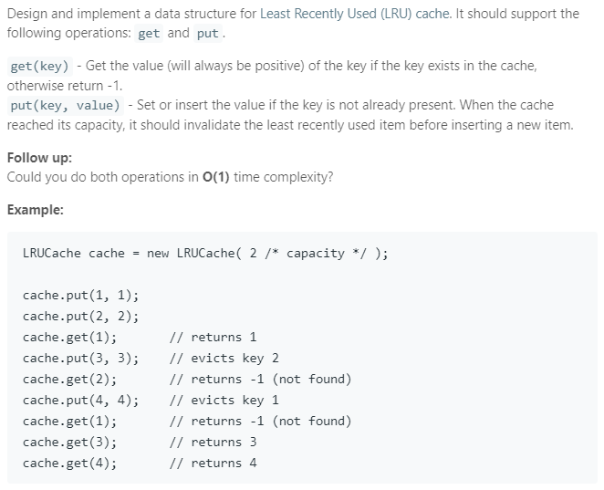

### Question



### My solution
Basic idea: hash table + doubly linked list  
Doubly linked list ensures O(1) popping from middle and both ends.  
Hash table ensures O(1) lookup.
```python
class Node(object):
    def __init__(self, key, val):
        self.key = key
        self.val = val
        self.next = None
        self.pre = None

class LRUCache(object):

    def __init__(self, capacity):
        """
        :type capacity: int
        """
        self.map = {}
        self.head = None
        self.tail = None
        self.N = capacity
    
    def moveNodeToFront(self, key):
        # if this node is already head, don't need to do anything
        if self.map[key].pre:
            pre_node = self.map[key].pre
            next_node = self.map[key].next
            pre_node.next = next_node

            # if we are moving the tail, we need to update tail pointer
            if next_node:
                next_node.pre = pre_node
            else:
                self.tail = pre_node

            # attach new node to front
            self.map[key].pre = None
            self.map[key].next = self.head
            self.head.pre = self.map[key]
            self.head = self.map[key]
        
    def get(self, key):
        """
        :type key: int
        :rtype: int
        """
        if key in self.map:
            self.moveNodeToFront(key)
            return self.map[key].val
        else:
            return -1

    def put(self, key, value):
        """
        :type key: int
        :type value: int
        :rtype: void
        """
        if key in self.map:
            self.moveNodeToFront(key)
            self.map[key].val = value
        
        else:
            # update head
            new_node = Node(key, value)
            self.map[key] = new_node
            new_node.next = self.head
            
            if self.head:
                self.head.pre = new_node
            
            self.head = new_node
            
            # if we tail is null, update
            if not self.tail:
                self.tail = self.head
                
            # if capacity exceeded, evict tail
            if len(self.map.keys()) > self.N:
                self.map.pop(self.tail.key, None)
                self.tail = self.tail.pre
                self.tail.next = None

# Your LRUCache object will be instantiated and called as such:
# obj = LRUCache(capacity)
# param_1 = obj.get(key)
# obj.put(key,value)
```